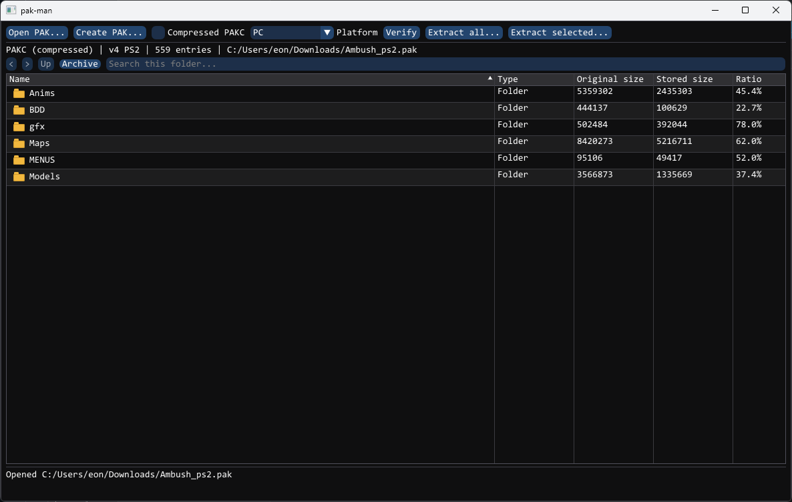

# pak-man

Windows archive manager for **Commandos: Strike Force**.
It can browse, verify, extract, and create both stored `PAKA` and
zlib-compressed `PAKC` archives for retail PC, PlayStation 2, and Xbox.
It also reads stored `PAKA` archives from the PS2 prototype.




## Features

- Explorer-style ImGui browser with folders, breadcrumbs, search, sorting,
  Ctrl/Shift selection, and selected-folder extraction.
- Streaming extraction and packing; archives are not loaded fully into memory.
- Full validation of indexes, offsets, zlib blocks, checksums, and output paths.
- Windows-1252 filenames and original file timestamps.
- Browsing, verification, and extraction of stored PS2 prototype v3 archives.
- Safe temporary output and verification before a new archive is committed.
- Companion CLI for automation.

The writer targets retail PC (`version 5`, `platform 1`), PS2 (`version 4`,
`platform 2`), and Xbox (`version 4`, `platform 3`) archives. See
[`docs/FORMAT.md`](docs/FORMAT.md) for the reverse-engineered layout.

## Build

Requirements:

- Windows 10 or 11
- Visual Studio 2022 or newer with **Desktop development with C++**
- CMake 3.24+
- Internet access during the first configure (dependencies are pinned)

From a Developer PowerShell:

```powershell
cmake -S . -B build -A x64 -DBUILD_TESTING=ON
cmake --build build --config Release --parallel
ctest --test-dir build -C Release --output-on-failure
```

The executables are created in `build/Release/`:

- `pakman.exe` — graphical application
- `pakman-cli.exe` — command-line application

Create a redistributable folder with license notices:

```powershell
cmake --install build --config Release --prefix portable
```

## CLI

```text
pakman-cli list archive.pak
pakman-cli verify archive.pak [--quick]
pakman-cli extract archive.pak -o directory [--overwrite]
pakman-cli create directory -o archive.pak [--type stored|compressed] [--platform pc|ps2|xbox] [--overwrite]
```

The graphical save dialog can replace an existing archive after confirmation.
The CLI requires `--overwrite` to replace an existing destination. The new
archive is verified before the existing file is replaced. Back up game files
before installing a modified archive. PC is the default platform when
`--platform` is omitted.

## License

MIT. Dear ImGui and zlib retain their respective licenses; see
[`THIRD_PARTY.md`](THIRD_PARTY.md).

This is an unofficial community tool and is not affiliated with or endorsed by
the developers, publishers, or rights holders of Commandos: Strike Force. No
game files or assets are included.
